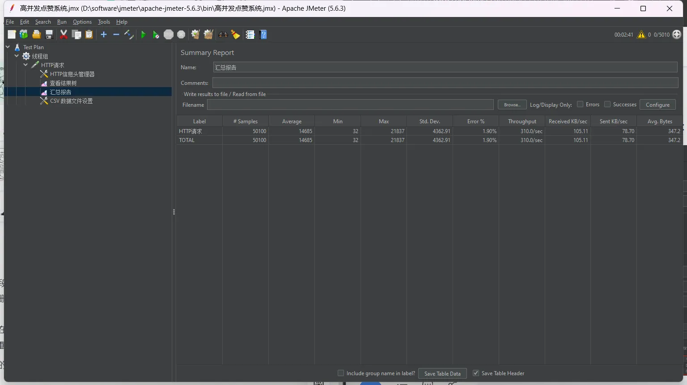
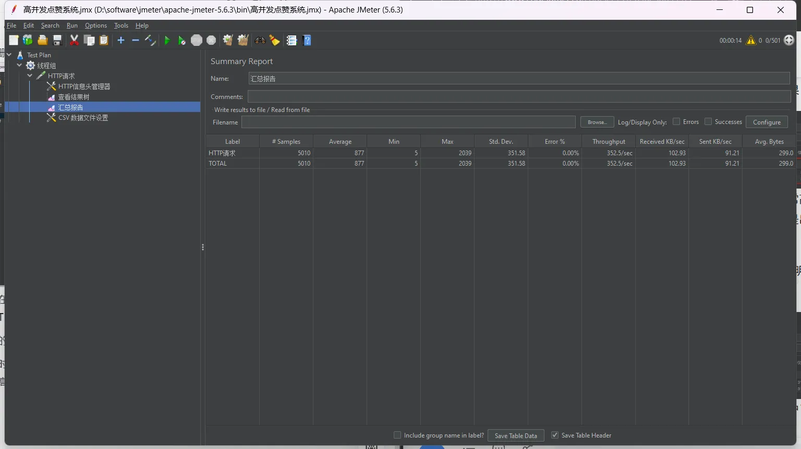
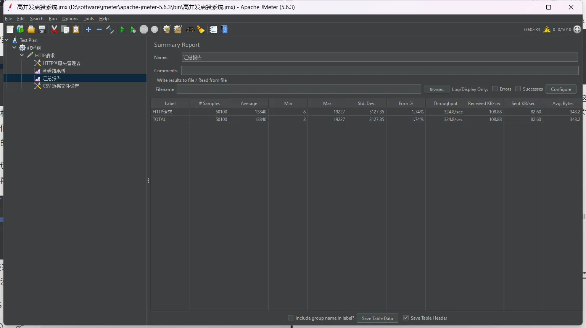
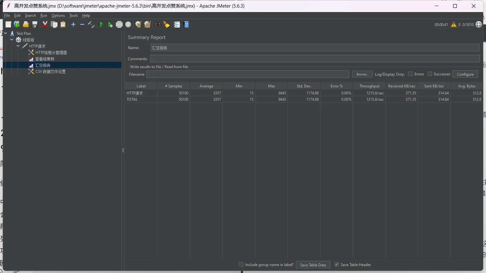
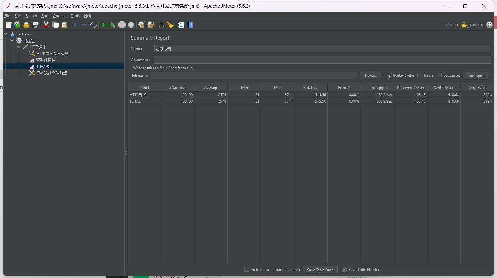
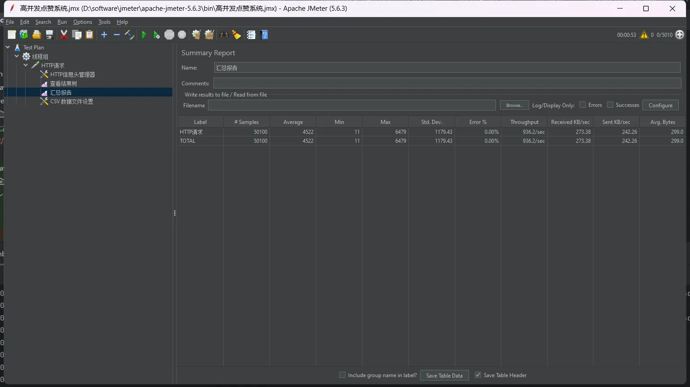

# 高并发点赞系统 🚀

基于 Spring Boot 3 + Java 21 构建的高性能、分布式点赞系统，支持每秒万级并发操作，适用于社交平台、电商评价、内容社区等场景。

## 📌 核心功能
- **原子操作**：点赞/取消点赞的幂等性保证
- **实时统计**：毫秒级更新内容点赞数
- **状态查询**：用户点赞状态 O(1) 复杂度判断
- **数据持久化**：多级存储保障数据可靠性
- **高并发支撑**：实测 QPS 1000+

## 🛠️ 技术栈
| 组件               | 用途                          | 关键技术点                     |
|--------------------|-----------------------------|------------------------------|
| **Spring Boot 3**  | 核心框架                      | 自动配置       |
| **Java 21**        | 虚拟线程支持                  | 提升并发吞吐量                |
| **TiDB**           | 分布式数据库                  | 水平扩展/HTAP 能力           |
| **Redis**          | 分布式缓存                    | Hash 结构存储用户-内容映射    |
| **Pulsar**         | 消息队列                      | 削峰填谷/异步处理             |
| **Caffeine**       | 本地缓存                      | 解决 Redis 热 Key 问题        |
| **HeavyKeeper**    | 热点识别算法                  | 动态发现高频访问内容          |

## 需求分析

点赞系统是社交平台、内容社区等场景的核心互动功能：  

### 典型应用场景
- 短视频/文章/博客的点赞互动
- 商品评价的喜欢功能
- 用户动态的点赞传播
- 社区评论的赞同表达

### 核心需求
梳理一下点赞系统的 p0 级功能（没有就不能上线）：

- **原子操作**：点赞/取消操作的幂等性保证
- **实时统计**：内容点赞数的即时更新
- **状态查询**：用户是否点赞的快速判断
- **数据持久**：点赞记录的可靠存储  

### 技术挑战
1. **高并发写入**：热点内容可能产生每秒万级请求
2. **数据一致性**：缓存与数据库的同步保障
3. **实时性要求**：用户操作后即时反馈状态
4. **扩展能力**：支撑业务规模指数级增长  

## 🏗️ 项目阶段

### 第一阶段：基础功能开发 🛠️
使用 Spring Boot + MyBatis-Plus 快速开发基础功能，可作为基础互动系统，适用于小规模应用。

**特点**：
- ✅ 轻量级架构（无额外复杂依赖）
- ✅ 易于维护
- ✅ 完美支持小型网站点赞需求

**具体功能**：
1. 👍 对实体进行点赞/取消点赞
2. 🔍 查询用户对实体的点赞状态
3. 🧮 查询实体点赞数统计

---

### 第二阶段：性能优化与高并发支持 ⚡
引入多级缓存策略 + Pulsar消息队列 + TiDB分布式数据库，大幅提升系统并发能力。

**优化方案**：

#### 🚀 多级缓存策略
- ☕ **Caffeine本地缓存**：减轻应用内存压力
- 🟥 **Redis分布式缓存**：实现跨节点数据共享
- 🔥 **HeavyKeeper算法**：智能识别热点数据

#### 📨 消息队列解耦
- ⚡ **Pulsar消息队列**：异步处理点赞事件
- 🌊 **削峰填谷**：平稳应对流量高峰
- 🔄 **批量处理+重试机制**：提升系统可靠性

#### 🗃️ 分布式数据存储
- 🎯 **TiDB分布式数据库**：支持水平扩展
- 🌐 **高可用架构**：保障服务稳定性

#### 💡 高并发优化技巧
- 🏷️ 本地缓存减负 + 热点识别
- 🧩 事件驱动架构解耦
- ⏱️ 批量处理 + 定时同步

---

### 第三阶段：企业级高可用架构 🚧（规划中）
1. 📊 **Prometheus + Grafana**：可视化监控告警系统
2. 🛡️ **多级降级方案**：DB/缓存/消息队列熔断保护
3. 🤖 **AI生成前端**：智能构建用户界面

## 🚀 性能压测

### 测试环境与基准
- **环境**：16G内存 / 8核CPU
- **条件**：固定请求接口与参数
- **基准**：异常率0%（出现异常则重新测试）

### 基础功能阶段测试
1. **初始测试**
    - 清空所有点赞记录
    - 压测结果：
        - 平均响应时间：14.6s
        - 最慢响应：21.8s
        - TPS：310/s
        - 出现异常

2. **调整线程数至501**
    - 响应时间提升
    - TPS保持310/s
    - 结论：仅适合低并发场景

### Redis校验优化测试
1. **清空记录，线程数5010**
    - 结果：
        - TPS：324/s
        - 响应时间仍较高
        - 存在异常
    - 瓶颈分析：MySQL热点行写入

2. **已点赞请求测试**
    - TPS虚假升高至1215.8/s（因Redis直接返回）

### 纯Redis方案测试
- **清空记录后压测**
    - TPS：1586/s
    - 响应时间稳定
    - 结论：Redis性能显著优于MySQL

### Pulsar消息队列测试
- **清空记录后压测**
    - TPS：低于Redis方案
    - 响应时间可接受
    - 优势分析：
        1. 生产环境网络IO差距更小
        2. 削峰填谷能力
        3. 系统解耦
        4. 避免定时任务同步延迟   

